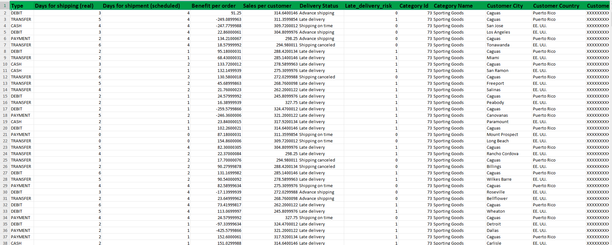

# Sales Performance Analysis for DataCo Global

## Business Context
DataCo Global is a multinational e-commerce organization that operates across various global regions. Management seeks help in understanding the business performance.

## Objective of the analysis
This analysis transforms raw data into actionable strategies and also equips DataCo Global with the insights needed to grow smarter, engage customers more effectively, and boost revenue sustainably.

## Data Overview
The dataset includes information on items product price, product name, purchased amount, payment type, shipping date, location and regions etc.

## Key Findings
- Consumer segment generates 52% of total sales, the corporate segment generates 30%, while the home segment generates 18% of the sales.
- The top countries by sales include USA, France and Mexico. While the top customers are Mary Smith (Belarus) and Mary Patterson (Italy), with $10.5K and $9.3K respectively.
- Regions by Profit: Central America: $599K, South America: $329K, Southern Europe: $223K.
- Top Product Categories by Profit: Fishing ($216K), Cleats ($150K), Cardio Equipment ($113K).
- Orders: 53K, down 17.6% from the previous year, Revenue: $12M, down 4.2%, Profit: $1M, down 0.5%.
- Top Regions with Late Deliveries: Central America (8K), Western Europe (7K), South America (4K).

## Dashboard

## Link to Power BI report
Click the link to explore the Power BI report: https://app.powerbi.com/view?r=eyJrIjoiMGVhYjRmYzEtMWZkNC00ODIxLTg1YTItN2I0ODA5N2IxNDY2IiwidCI6ImExYjdiNjg0LTA3MzctNGI4NC04YmQxLWUwNzk3Zjg0MGEwYiJ9

## Business Implications
Late deliveries can damage brand reputation and lead to customer churn. The company must re-evaluate its sales strategy, customer acquisition efforts, or product-market fit.

## Recommendations
- Improve Logistics & Delivery in late-delivery-prone regions (Central America, Western Europe).
- Focus marketing on the high-performing Consumer segment.
- Promote high-margin products like Fishing gear and Cleats.
- Retain top customers with loyalty programs and targeted campaigns.

## Conclusion
DataCo Global is underperforming in orders and delivery, but has strong product and regional profitability potential. By fixing logistics, focusing on its top customer segment, and leveraging high-margin products, the company can reverse its decline and boost profitability.

## Tools Used
Microsoft & Power BI
